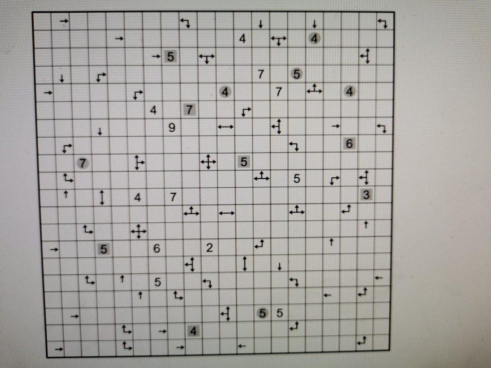
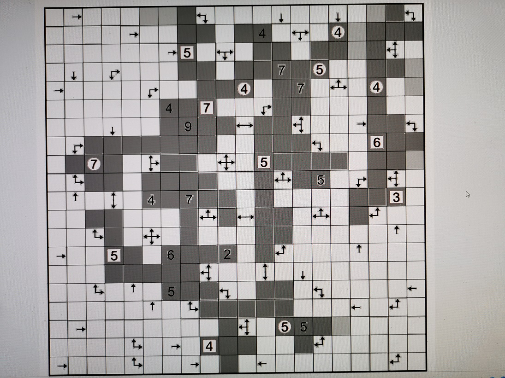
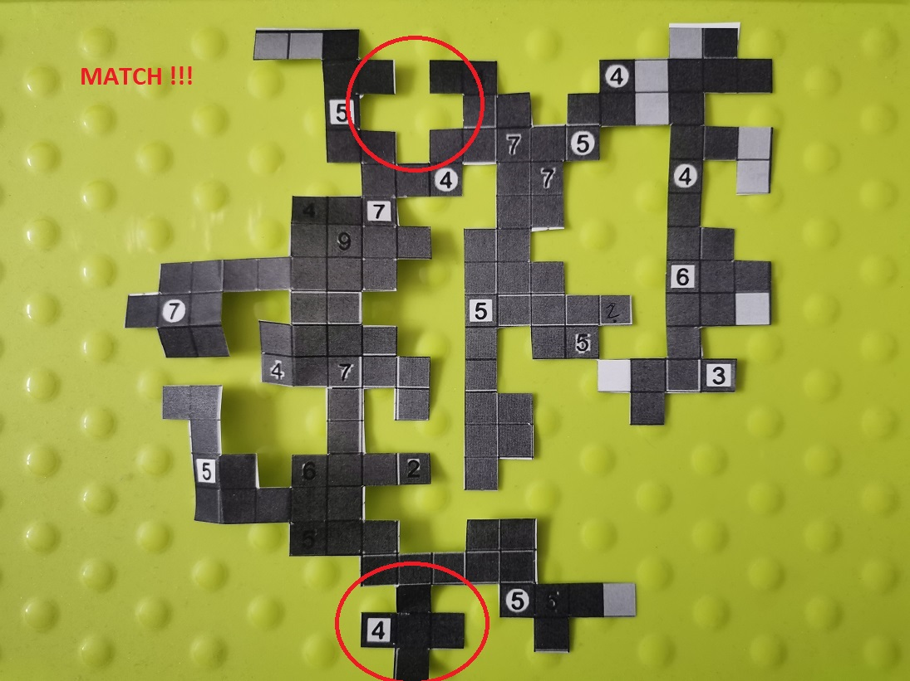
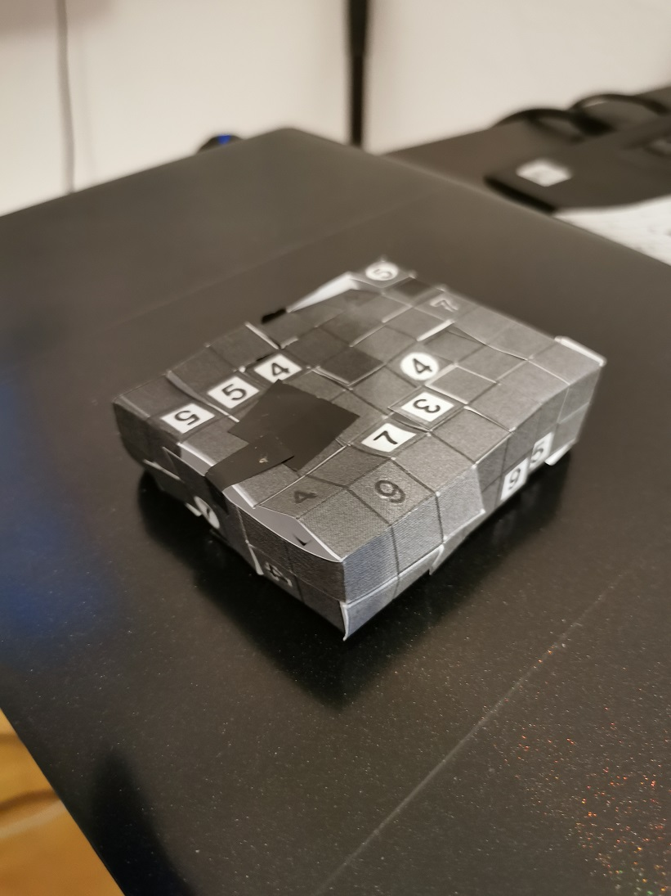
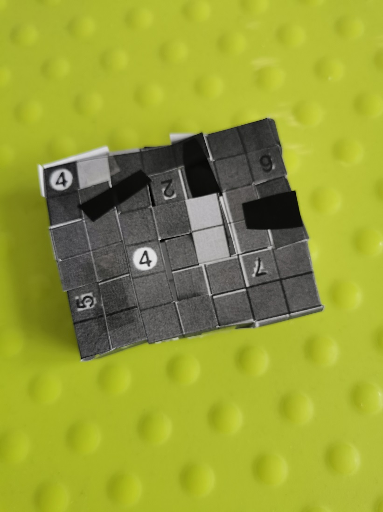
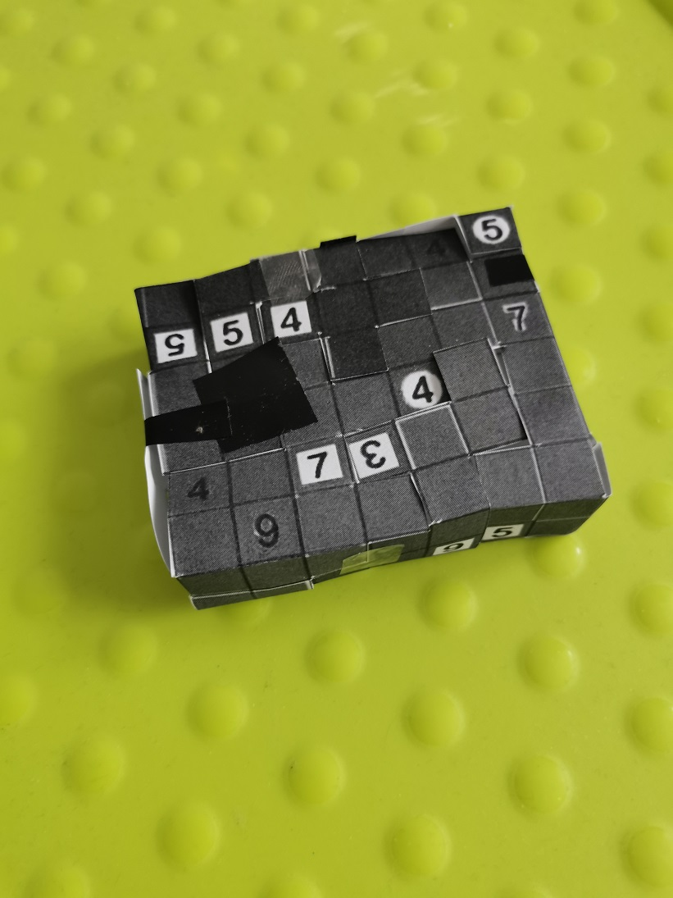
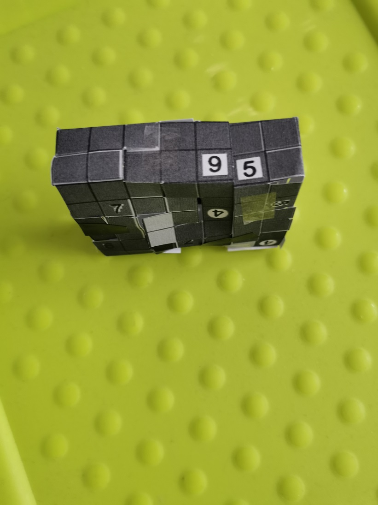
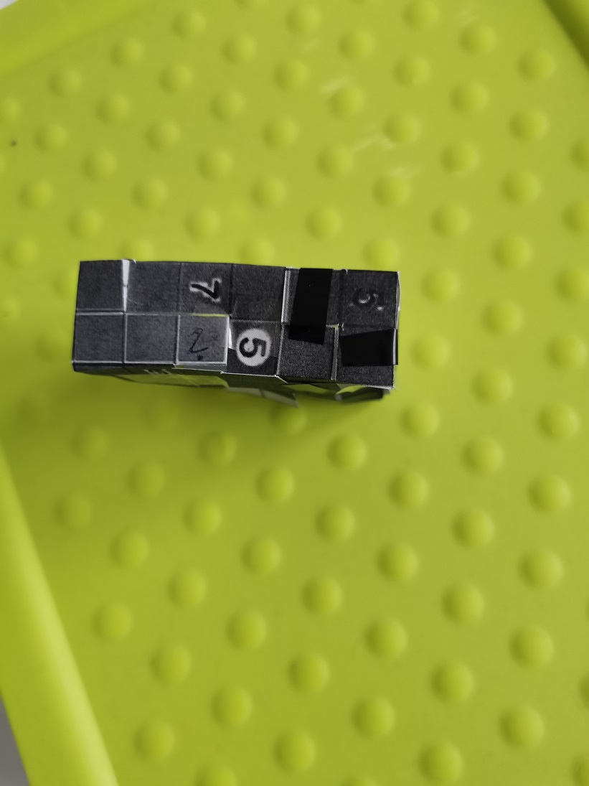
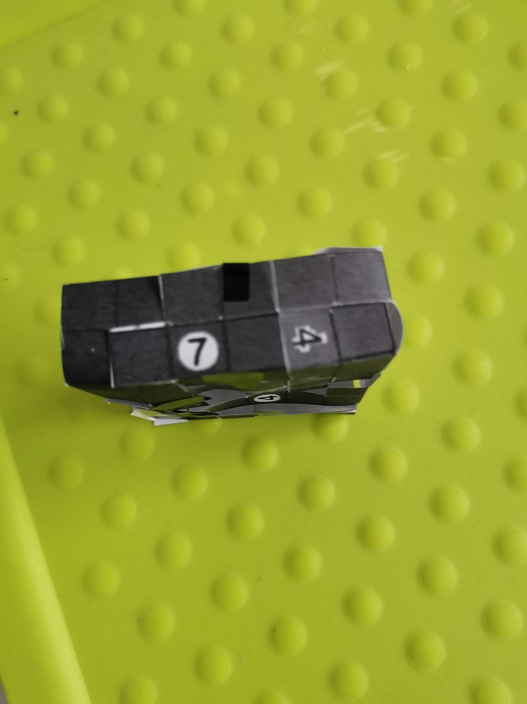

dark gray - parts of final grid <br>
light gray - possible parts of final grid

start with observation that single arrow:
```
|??|??|??|??|
|??|??|??|??|
|??|??|->|??|
|??|??|??|??|
|??|??|??|??|
```
indicates three empty fields:
```
|??|??|??|??|
|??|??|  |??|
|??|  |->|??|
|??|??|  |??|
|??|??|??|??|
```
otherwise '->' would be replaced by different set of arrows, two arrows:
```
|??|??|   |??|
|??|??|<->|??|
|??|??|   |??|
```
etc.














